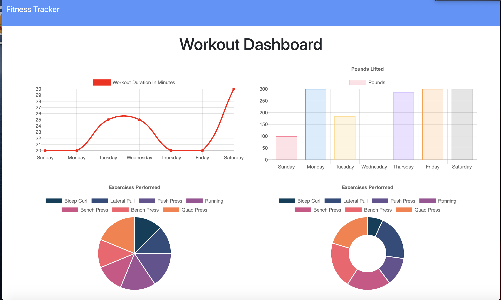

 
  # Fitness Tracker 
  ## Description 
  I created a fitness tracker where you can enter your cardio, and resistance training. It will show you your total duration for the day. It also has a nice graph, that allows you to track exercises performed, workout duration, and weight lifted. 
  ## Table of Contents 
  * [Installation](#installation) 
  * [Usage](#usage) 
  * [Example](#example)
  ## Installation
  You first need to run npm install to install all the dependencies, then start the server by running node server.js. My app is set to localhost 8080.
  ## Usage
  Once the app is running, it will show you your most recent workout on the homepage. You can also click on the dashboard to view the charts. You can also add a new workout, by clicking the new workout button.
  ## Example
  
   
  
